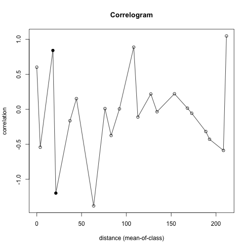

## Factores ambientales que definen la composicion de las comunidades bacterianas en un suelo haloalcalino extremo altamente heterogeneo

1. Edit YAML front matter
2. Write using R Markdown
3. Use an empty line followed by three dashes to separate slides!

--- fill  #imagen


---
## Correlograma pH


```r
C1.pH <- correlog(E, N.1, MuestreoInicial$pH, increment=10, resamp=1000, latlon=F, quiet=T)
```

```
## $n
##  0  1  2  3  4  5  7  8  9 10 11 12 13 14 16 17 18 19 20 21 22 
##  2  7  6  3  6  6  2  1  5  3  1  1  5  3  4  3 11  1  4  3  1 
## 
## $mean.of.class
##          0          1          2          3          4          5 
##   0.000000   3.893757  18.015494  21.316407  37.071488  44.262348 
##          7          8          9         10         11         12 
##  63.488546  76.138078  82.992885  92.261652 108.234664 112.854073 
##         13         14         16         17         18         19 
## 127.309213 134.209955 153.646758 168.130095 172.955038 188.697025 
##         20         21         22 
## 192.840225 208.331335 211.729527 
## 
## $correlation
##            0            1            2            3            4 
##  0.601119664 -0.542147356  0.840226265 -1.197410777 -0.163809191 
##            5            7            8            9           10 
##  0.151866107 -1.380265920  0.009797061 -0.374653604  0.005551668 
##           11           12           13           14           16 
##  0.886773968 -0.111196641  0.218306508 -0.035689293  0.221536039 
##           17           18           19           20           21 
##  0.015861908 -0.056695719 -0.317704689 -0.428463961 -0.587590390 
##           22 
##  1.046885934 
## 
## $x.intercept
## (Intercept) 
##    1.846454 
## 
## $p
##  [1] 0.177822178 0.080919081 0.008991009 0.024975025 0.395604396
##  [6] 0.246753247 0.024975025 0.496503497 0.220779221 0.424575425
## [11] 0.134865135 0.402597403 0.179820180 0.495504496 0.253746254
## [16] 0.419580420 0.470529471 0.337662338 0.206793207 0.140859141
## [21] 0.126873127
## 
## $call
## [1] "correlog(x = E, y = N.1, z = MuestreoInicial$pH, increment = 10, "
## [2] "    resamp = 1000, latlon = F, quiet = T)"                        
## 
## attr(,"class")
## [1] "correlog"
```

---
## Correlograma pH
======================================


```r
plot(C1.pH)
```

 

---
## Slide 4
======================================

$$I(d) =\frac{\frac{1}{w} \sum_{h=1}^{n} \sum_{i=1}^{n} W_{hi} (y_{h}-\tilde{y})(y_{i}-\tilde{y})}{\frac{1}{n} \sum_{i=1}^{n} (y_{i}-\tilde{y})^2 }$$

---
## Slide 5
======================================
Animated list boom

> 1. Soy 1
> 2. Una potranquilla1
> 3. Brava1

---
## Slide 6
======================================

$$\tilde{\gamma}(h) = \frac{1}{2N(h)} \sum^{N(h)}_{\alpha =1 } [Z(u_\alpha)-Z(u_\alpha + h)]^2$$

---


